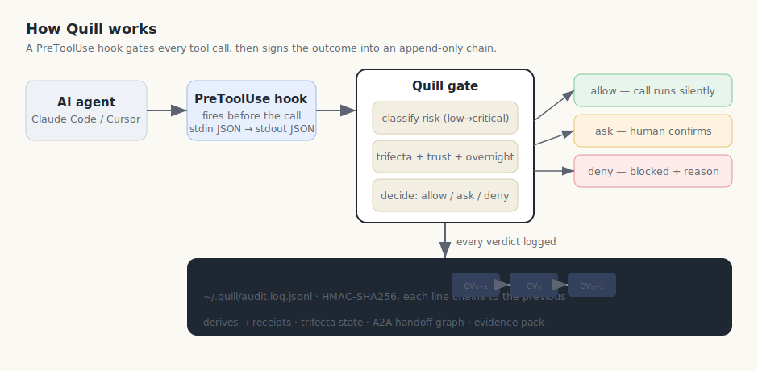
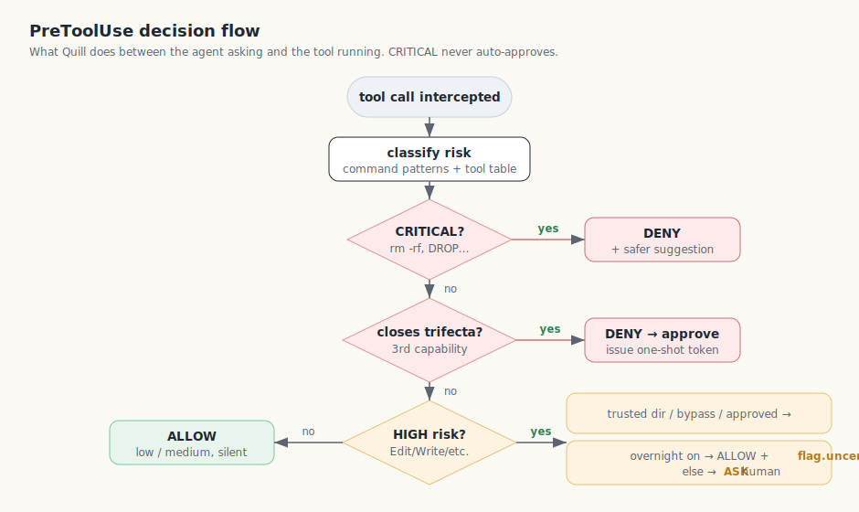
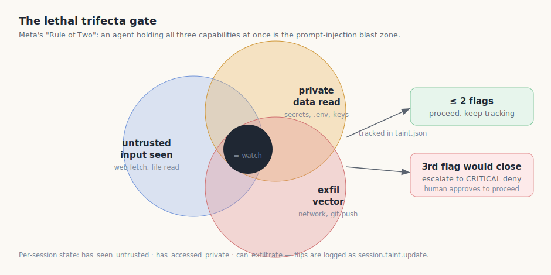
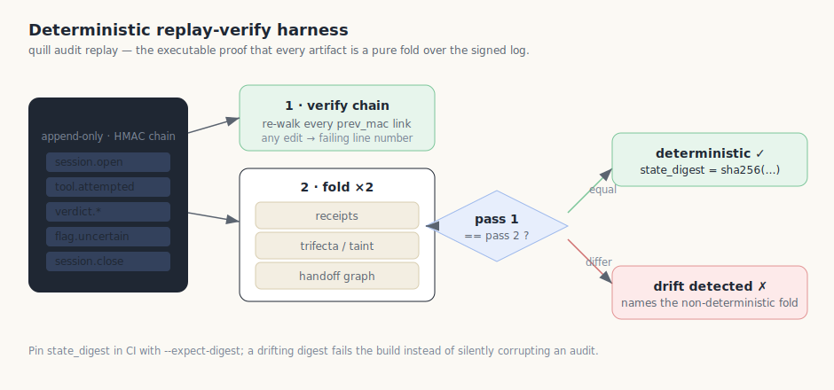

# Quill — How It Works, Operate, and Verify

A practical guide to what Quill does, how to read its output, how to bring it
back up on a fresh machine, and how the determinism guarantee is enforced.

Quill is a gate, a ledger, and a set of derived artifacts. It sits on the
`PreToolUse` hook of an agent harness (Claude Code, Cursor), decides whether a
tool call should run, and signs every outcome into an append-only,
tamper-evident audit chain. Everything an operator looks at later — receipts,
trifecta state, the handoff graph, the evidence pack — is a *pure, deterministic
fold* over that one log.

---

## 1. The data flow



The agent tries to run a tool. The harness fires the `PreToolUse` hook before
the call executes and hands Quill the tool name and arguments on stdin. Quill
classifies the call's risk, applies the trifecta / trust-scope / overnight
modifiers, and returns `allow`, `ask`, or `deny`. Whatever it decides, it
appends a signed event to `~/.quill/audit.log.jsonl`. The chain is the source
of truth; the human-facing views are derived from it on demand.

---

## 2. The decision flow



The order is deliberate and safety-first:

1. **CRITICAL** patterns (`rm -rf`, `DROP TABLE`, `git push --force`, `vercel
   --prod`, `sudo`, `curl | sh`, …) **always deny**, with a paste-able safer
   suggestion. Overnight mode never changes this.
2. A call that would **close the lethal trifecta** for the first time is
   escalated to a CRITICAL deny and issues a one-shot approval token, so a
   human decides before untrusted-input + private-data + exfil ever line up.
3. **HIGH-risk** calls (Edit / Write and the HIGH command set) normally **ask**.
   They downgrade to a silent allow inside a trusted directory, under bypass
   mode, or when a one-shot approval was granted — and under **overnight mode**
   they auto-allow *and* self-flag for morning review.
4. **LOW / MEDIUM** calls allow silently (still logged).

---

## 3. The lethal trifecta



Following Meta's "Agents Rule of Two," Quill tracks three per-session
capabilities — `has_seen_untrusted`, `has_accessed_private`, `can_exfiltrate`.
Two of three is the watch zone; the call that would close all three is the
prompt-injection blast radius, so it is forced to a human decision regardless
of the underlying call's own risk label. State lives in `taint.json` and every
flip is logged as a `session.taint.update` event.

---

## 4. Agent Receipts — `did / changed / uncertain / to_verify`

A **Receipt** is the session summary auditors and operators actually want, all
derived from the log:

| field | filled from |
|---|---|
| `did` | distinct tools used (`tool.attempted`) |
| `changed` | files mutated (Edit / Write / MultiEdit / NotebookEdit paths) |
| `uncertain` | HIGH/CRITICAL calls that were allowed — **including overnight auto-allows** |
| `to_verify` | `agent.flag.uncertain` events the agent/operator surfaced |
| `trust_delta`, `tdr_contribution` | executed vs. blocked/asked ratio |

```bash
quill receipts list              # one row per session
quill receipts show <session>    # full did/changed/uncertain/to_verify
quill receipts emit  <session>   # freeze the receipt into the chain
quill flag "unsure about the migration order"   # self-flag → to_verify
```

`uncertain` and `to_verify` used to be perpetually empty: nothing emitted
`agent.flag.uncertain`, and overnight auto-allows used an event type the
deriver ignored. Both are now wired — overnight high-risk auto-allows emit an
`agent.flag.uncertain` (so the morning recap has something to review), and
`session.close` freezes a `session.receipt` into the chain automatically.

---

## 5. The determinism guarantee



Because every artifact is a pure fold over the log, the same log must always
produce the same output. `quill audit replay` is the executable proof: it
re-verifies the HMAC chain, then folds the log into receipts / taint / handoffs
**twice** and asserts the two passes are byte-identical, printing a
`state_digest` you can pin.

```bash
quill audit replay                       # human-readable
quill audit replay --json                # machine-readable ReplayResult
quill audit replay --expect-digest <hex> # fail CI on drift (exit 4)
```

Exit codes: `0` ok · `2` chain broken · `3` non-deterministic fold · `4` digest
mismatch. Pin the digest in CI and any accidental non-determinism (dict
ordering, wall-clock leakage, set iteration) trips the build loudly instead of
silently corrupting an audit.

> **Tamper-evident, not tamper-proof.** A holder of the MAC key can forge a
> consistent chain. Keep `~/.quill/key` (mode `0600`) off-box from the log for
> the guarantee to hold — see `SECURITY.md`.

---

## 6. Restart runbook — bringing Quill back on a fresh machine

If a migration restored your runtime data (`~/.quill`) but not the source or
install, Quill stops gating because the package isn't installed and the hook no
longer points at it. Restore it in order:

```bash
# 1. Re-clone and install the package
git clone https://github.com/manumarri-sudo/quill.git ~/quill
cd ~/quill && pipx install -e .          # or: pip install -e .

# 2. Re-add the Claude Code PreToolUse hook (idempotent)
quill claude-hook-install                # writes ~/.claude/settings.json
#    (Cursor: quill cursor-hook-install)

# 3. Verify the restored chain still validates end-to-end
quill audit verify
quill audit replay                       # chain + determinism in one shot

# 4. Restart the live dashboard / watcher (clears a stale watch.pid)
quill watch --daemon

# 5. Recreate or prune any missing trust paths
#    edit ~/.quill/config.toml → [trust] paths, removing folders that
#    no longer exist so trust-scope downshifts resolve correctly
quill doctor                             # confirms config, key, hook, log
```

Then restart Claude Code (or Cursor) so it picks up the reinstalled hook. A
healthy `quill doctor` plus a green `quill audit replay` means you're back to a
gating, signing, verifiable state.
